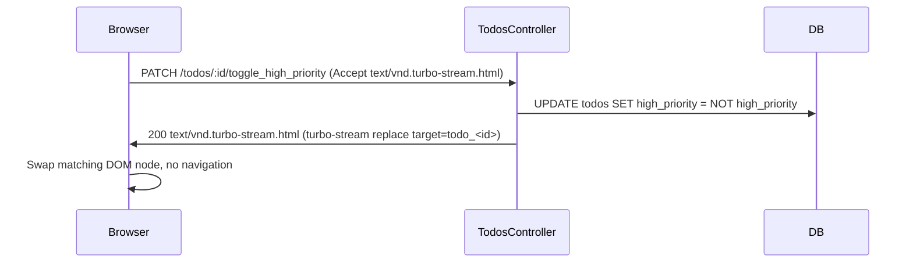

### Why this is small

- The index already has a stable `
` container (line 7 of [app/views/todos/index.html.erb](app/views/todos/index.html.erb)) and each row is wrapped in `
">` by [app/views/todos/_todo.html.erb](app/views/todos/_todo.html.erb) line 1, so the stream target already exists.
- Both `show` ([app/views/todos/show.html.erb](app/views/todos/show.html.erb) line 3) and `index` reuse `_todo`, so a single partial update covers both pages.
- No new partial is needed for the stream view — we reuse `_todo`.

### Flow

### Assumptions (flag any to change)

- Default value for `high_priority` is `false`, `NOT NULL`. Existing rows back-fill to `false`.
- The route uses `PATCH` (idiomatic for "modify an existing resource attribute"). `POST` would also work.
- The toggle is rendered inline inside the `_todo` partial as a `button_to` with `data: { turbo_method: :patch }` (or just `method: :patch`), so it works on both `index` and `show` with one edit.
- The HTML fallback (non-Turbo client) redirects back to the index. This preserves graceful degradation and only adds one line.
- No test for the fixture default — covered implicitly by the controller test's flip assertion.

### Numbered changes

1. **Migration: add the column.** Create `db/migrate/<timestamp>_add_high_priority_to_todos.rb` with `add_column :todos, :high_priority, :boolean, null: false, default: false`. Run `bin/rails db:migrate` so [db/schema.rb](db/schema.rb) is regenerated (do not hand-edit, per [AGENTS.md](AGENTS.md) line 29).

2. **Route: add the member action.** In [config/routes.rb](config/routes.rb) line 2, change `resources :todos` to a block form that adds `patch :toggle_high_priority` inside `member do ... end`. This yields the helper `toggle_high_priority_todo_url(@todo)` and the path `PATCH /todos/:id/toggle_high_priority`.

3. **Controller: add the action.** In [app/controllers/todos_controller.rb](app/controllers/todos_controller.rb):
   - Add `:toggle_high_priority` to the `before_action :set_todo, only: %i[...]` list at line 2 so `@todo` is loaded.
   - Add a new public `toggle_high_priority` action below `destroy` (around line 58) that calls `@todo.update!(high_priority: !@todo.high_priority)` and then `respond_to do |format|` with `format.turbo_stream` (renders the convention view) and `format.html { redirect_to todos_path, status: :see_other }` as the no-JS fallback. No changes to `todo_params`.

4. **Partial: render the badge and the toggle button.** Update [app/views/todos/_todo.html.erb](app/views/todos/_todo.html.erb):
   - Inside the existing `
">` (line 1), add a small element showing high-priority state when `todo.high_priority?` is true (e.g. a `` with the text "High priority"). When false, omit the badge or show a muted placeholder. Keep markup minimal.
   - Add a `<%= button_to ..., toggle_high_priority_todo_path(todo), method: :patch %>` whose label reflects the next state (e.g. "Unmark high priority" when currently true, "Mark high priority" when false). Since this lives inside the partial, the same control shows up on `index` and `show`.

5. **Turbo Stream view: create the response template.** Create `app/views/todos/toggle_high_priority.turbo_stream.erb` containing one line: `<%= turbo_stream.replace dom_id(@todo), partial: "todos/todo", locals: { todo: @todo } %>`. The `.turbo_stream.erb` suffix is what makes Rails answer with the `text/vnd.turbo-stream.html` content type — that filename convention is the entire wire-up.

6. **One controller test for the Turbo Stream response.** In [test/controllers/todos_controller_test.rb](test/controllers/todos_controller_test.rb), add a new test below the existing block:
   - Issue the request with `patch toggle_high_priority_todo_url(@todo), as: :turbo_stream` — `as: :turbo_stream` is what sets the `Accept: text/vnd.turbo-stream.html` header and tells Rails to pick the `.turbo_stream.erb` view.
   - Assert `assert_response :success`.
   - Assert `assert_equal "text/vnd.turbo-stream.html", @response.media_type` — this is the precise check the prompt asks for.
   - Assert the row swap is in the body: `assert_match /turbo-stream action="replace" target="#{ActionView::RecordIdentifier.dom_id(@todo)}"/, @response.body`.
   - Assert the side effect: `assert_equal !was_priority, @todo.reload.high_priority`, where `was_priority` was captured before the request.

### Things explicitly NOT in scope

- No model-level validations or scopes for `high_priority`.
- No model broadcasts (`broadcasts_to`/Action Cable) — this is a request/response Turbo Stream, not a pushed one.
- No filtering/sorting by priority on the index.
- No changes to JSON views or to `todo_params` (the new attribute is not a form-submitted field).
- No system test — the user asked for **one** automated test, and a controller test is the right level for verifying the MIME type.
- No `due_date` work — this plan is independent of [.cursor/plans/part-3-plan.md](.cursor/plans/part-3-plan.md).

### Verification

- `bin/rails db:migrate`, then `bin/rails test test/controllers/todos_controller_test.rb` (should pass, including the new MIME-type assertion).
- Manual: `bin/dev`, visit `/todos`, click the toggle on a row — only that row's badge and button label change, no navigation, no flash of the whole page.
- Sanity: `curl -i -X PATCH -H "Accept: text/vnd.turbo-stream.html" http://localhost:3000/todos/<id>/toggle_high_priority` (with a CSRF-disabled test or after grabbing a token) should return `Content-Type: text/vnd.turbo-stream.html` and a `<turbo-stream action="replace" target="todo_<id>">` body.